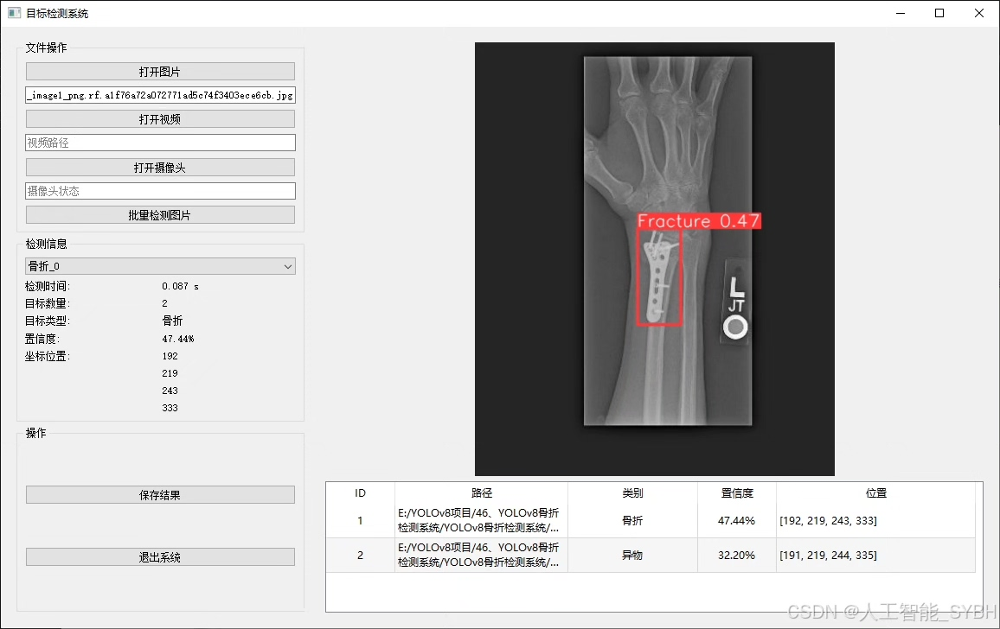
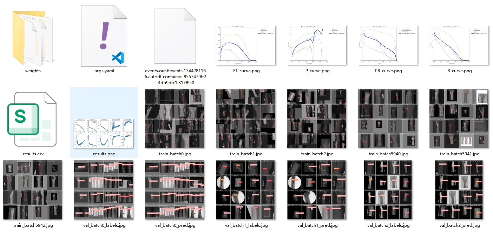
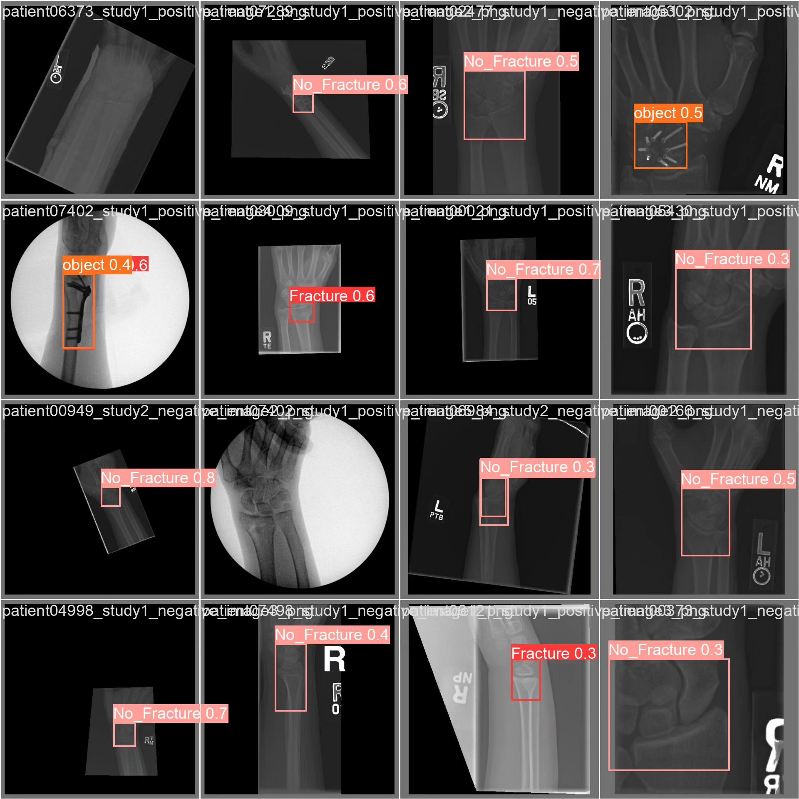
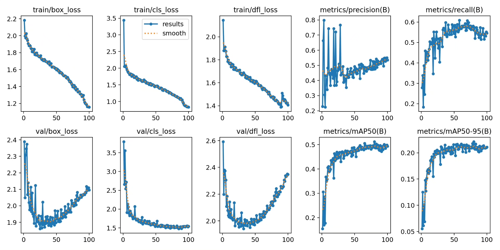

# Based on YOLOv8 deep learning for the detection of pneumonia (YOLOv8+YOL)

## Body

This project is based on the YOLOv8 deep learning framework, developing a highly efficient and accurate pneumonia intelligent detection system for medical imaging (such as X-ray or CT scans) to identify pneumonia. The system is optimized for single-classification ('Pneumonia' pneumonia), using a dataset containing 3,772 training images, 539 validation images, and 1,078 test images for training and evaluation. This system can quickly and automatically recognize pneumonia lesions, assisting doctors in diagnosis, improving medical testing efficiency, and reducing the risk of missed or misdiagnosed cases.

The company's products have been granted the official commercial license certification by YOLO.

We provide after-sales service:

After payment, we will provide WeChat IDs for instant questions and answers.

Environmental configuration: We will provide a tutorial on how to set up the environment, with WeChat providing Q&A services.

Remote installation service: If you need remote configuration, an additional fee of 69 is required, with all costs refunded if the configuration fails (only the installation fee is refunded for older computers).

Retraining the dataset: After setting up the environment, you can train on your own computer. If you need us to retrain, just pay 69 plus the computing power fee (2.5 yuan/hour).

Full after-sales service

## Images

## Payment

Here is a pay link on Stripe ( https://buy.stripe.com/3cs8yP7sY87d0vu9AB ). Please contact me lonlonago@foxmail.com after funding $89, and I will send you a complete data files , thank you!

